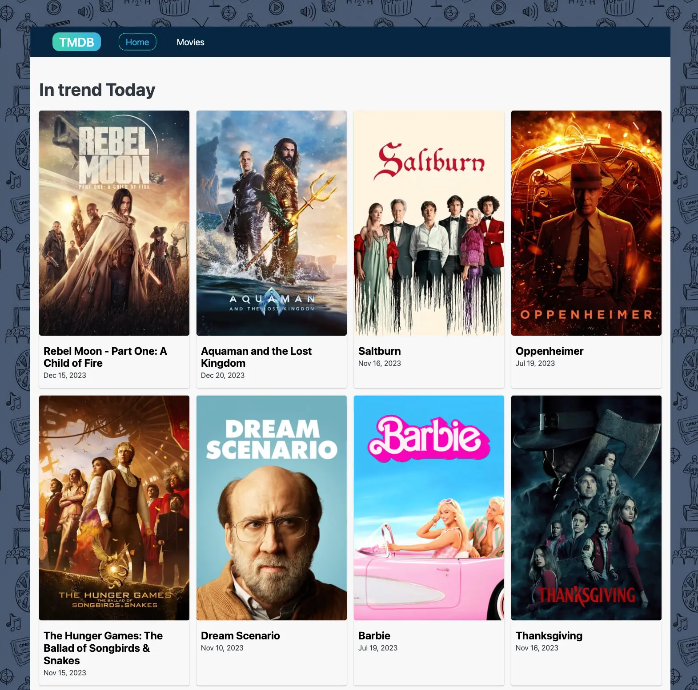

# Cine Search App

Welcome to CineSearch, the ultimate movie database application that allows you to search for movies using keywords, access detailed information about films, explore cast members, and read reviews. With its intuitive interface, CineSearch simplifies your journey into the cinematic world.

## Table of Contents
- [Features](#features)
- [Technologies Used](#technologies-used)
- [Contributing](#contributing)
- [Get in Touch](#get-in-touch)

## Features

- **Movie Search:** Effortlessly search for movies using keywords.
- **Film Details:** Dive into detailed information about each film.
- **Actor Cast:** Access the cast information for each movie.
- **Reviews:** Read reviews and ratings provided for each movie.

Start exploring the world of cinema today 🍿🌟! with CineSearch you'll have the world of cinema at your fingertips, making it easy and enjoyable to explore and discover.

## Technologies Used

### Core Technologies
- HTML: Structuring the content and layout.
- CSS: Styling and design for an appealing interface.
- JavaScript: Adding interactivity and functionality.

### Libraries and Frameworks
- React: Building the user interface efficiently.
- React Router DOM: Managing navigation and routing.
- Axios: Handling HTTP requests for data retrieval.
- Formik & Yup: Form handling and validation.
- Styled Components: Styling components with CSS in JS.

## Contributing

Contributions are welcome! If you have ideas for improvements or new features, fork this repository, make your changes, and submit a pull request.

## Get in Touch

Have questions or feedback? Reach out to us at [vasylkiv.t@gmail.com](mailto:vasylkiv.t@gmail.com).

